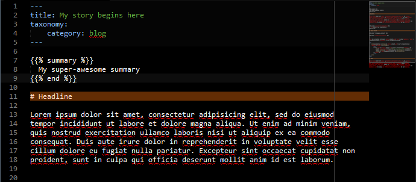

# [][project]

[][project] [][issues] [](LICENSE "License") <span style="float:right;">[][flattr] [][paypal]</span>

> This plugin introduces shortcodes to be used as simple snippets inside a document to be rendered by Grav.

##### Table of Contents:

* [About](#about)
* [Installation and Updates](#installation-and-updates)
* [Usage](#usage)
    * [For end-users](#for-end-users)
    * [For developers](#for-developers)
    * [Available shortcodes](#available-shortcodes)
* [Contributing](#contributing)
* [Licencse](#license)

## About

`Shortcodes` is a plugin for [**Grav**](http://getgrav.org) used to extend Markdown's ability to do nifty things with very little effort.

*Shortcodes are shortcuts*. Using a simple content format [shortcodes](#available-shortcodes) can embed files or create objects that would normally require lots of complicated, ugly code in just one line.



## Installation and Updates

Installing or updating the `Shortcodes` plugin can be done in one of two ways. Using the GPM (Grav Package Manager) installation update method or (i.e. `bin/gpm install shortcodes`) manual install by downloading [this plugin](https://github.com/sommerregen/grav-plugin-shortcodes) and extracting all plugin files to

    user/plugins/shortcodes

For more informations, please check the [Installation and update guide](docs/INSTALL.md).

## Usage

The `Shortcodes` plugin comes with some sensible default configuration, that are pretty self explanatory:

### Config Defaults

```yaml
# Global plugin configurations

enabled: true               # Set to false to disable this plugin completely

# Default configurations for special shortcodes

shortcodes:
  assets:
    enabled: true
    options:
      type: "css"           # Assets type (either "css" or "js")
      inline: false         # Include assets as block or inline argument
      priority: 10          # Priority to add CSS or JS to Grav pipeline, bigger comes first
      pipeline: false       # Pipeline assets or not
      load: ""              # Load asset either asynchronously "async" or deferred "defer"

  comment:
    enabled: true

  embed:
    enabled: true
    options:
      template: ""          # Default template to render a page

  markdown:
    enabled: true
    options:
      extra: true           # Enable support for Markdown Extra

  summary:
    enabled: true

   twig:
    enabled: true
```

If you need to change any value, then the best process is to copy the [shortcodes.yaml](shortcodes.yaml) file into your `users/config/plugins/` folder (create it if it doesn't exist), and then modify there. This will override the default settings.

If you want to alter the settings for one or a few pages only, you can do so by adding page specific configurations into your page headers, e.g.

```yaml
shortcodes: false
```

to disable the `Shortcodes` plugin just for this page.

### For end-users

In your content files, a shortcode can be called by using `{}`
respectively. Shortcodes are space delimited (parameters with spaces can be quoted).

The first word is always the name of the shortcode. Parameters follow the name.The format for named parameters models that of HTML with the format `name="value"`.

Some shortcodes use or require closing shortcodes. Closing shortcodes either match the name of the shortcode with prepended `end` like `{}` or just `{}` e.g.,

```
{}
  My summary
{}
```

Shortcodes can be nested and may require parameters to work. Parameters to shortcodes can either be passed in two ways

```
{}
OR
{}
```

Sometimes you may want to print the shortcode without processing it. To archive this you have two options. Either you disable the `Shortcodes` plugin per page using `shortcodes: false` or enclose the (whole) shortcode with the special `{}...{}` shortcode like this:

```
{}
  {}
{}
```

You can further comment out blocks of text or code using the `{# ... #}` tag as already known from Twig.

### Twig Function

`Shortcodes` provides a Twig function to render shortcodes for any text. To use it, place the following line of code in the theme file:

```twig
{{ shortcodes("A text and shortcodes") }}
```

### Available shortcodes

The `Shortcodes` plugin offers some of the shortcodes by default and plugins can add their own as well via the [Shortcode API](#for-developers). The already supported shortcodes are listed in the following:

##### System

- `{}` adds CSS and JS assets directly to the site. [&raquo; Full instructions](docs/assets.md)
- `{}` embeds a page or the contents of a page. [&raquo; Full instructions](docs/embed.md)
- `{}`is a shortcut to parse texts using Markdown syntax in a document. [&raquo; Full instructions](docs/markdown.md)
- `{}` renders custom texts using the Twig templating engine. [&raquo; Full instructions](docs/twig.md)

##### Images and Documents

- `{}` allows you to use comments and annotations in a Markdown document without being outputted to the user. [&raquo; Full instructions](docs/comment.md)
- `{}` marks sections as being raw text that should not be parsed. [&raquo; Full instructions](docs/raw.md)
- `{}` sets the summary of page. [&raquo; Full instructions](docs/summary.md)

##### Audio

##### Video

##### Miscellaneous

Useful shortcodes for adding a blog archive index, contact form, polls, and more.

## For developers

The `Shortcodes` plugin offers developers to register their own shortcodes (here: `myblockshortcode` and `myinlineshortcode`). To do this `Shortcodes` provides an event `onShortcodesInitialized`, which could be used to register new shortcodes via the provided `Grav\Plugin\Shortcodes\Shortcodes::register` method. For example in your custom plugin use

```php
namespace Grav\Plugin;

use Grav\Plugin\Shortcodes;

class MyPlugin extends Plugin
{
  public static function getSubscribedEvents()
  {
    return [
      'onShortcodesInitialized' => ['onShortcodesInitialized', 0]
    ];
  }

  public function onShortcodesInitialized(Event $event)
  {
    // Initialize custom shortcode
    $shortcode = new MyShortcodes();

    // Create block shortcode
    $block = new Shortcodes\BlockShortcode('myblockshortcode', [$shortcode, 'block']);

    // Create inline shortcode
    $inline = new Shortcodes\InlineShortcode('myinlineshortcode', [$shortcode, 'inline']);

    // Register shortcodes
    $event['shortcodes']->register($block);
    $event['shortcodes']->register($inline);

    // Or register shortcodes from class (calls getShortcodes internally)
    $event['shortcodes']->register($shortcode);
  }
}
```

The `MyShortcodes` class has basically the format

```php
namespace Grav\Plugin;

use Grav\Plugin\Shortcodes;
use RocketTheme\Toolbox\Event\Event;

class MyShortcodes
{
  public function getShortcodes()
  {
    $options = [];

    return [
      new Shortcodes\BlockShortcode('myblockshortcode', [$this, 'block'], $options).
      new Shortcodes\InlineShortcode('myinlineshortcode', [$this, 'inline'], $options)
    ];
  }

  public function block(Event $event)
  {
    // do something and return string
  }

  public function inline(Event $event)
  {
    // do something and return string
  }
}
```
where `myblockshortcode` and `myinlineshortcode` are placeholders for your block and inline shortcode names respectively. When `{}...{}` is found in the text the method `block` is called and `inline` when `{}` is found. The `event` argument is an array of

- the body text ("body")
- the options passed to the shortcode ("options")
- the grav instance ("grav")
- the shortcodes instance ("shortcodes")
- the current page ("page")

which can be used in your custom functions.

For further examples, please study the already available shortcodes in the [provided shortcodes classes](classes/Shortcodes).

## Contributing

You can contribute at any time! Before opening any issue, please search for existing issues and review the [guidelines for contributing](docs/CONTRIBUTING.md).

After that please note:

* If you find a bug, would like to make a feature request or suggest an improvement, [please open a new issue][issues]. If you have any interesting ideas for additions to the syntax please do suggest them as well!
* Feature requests are more likely to get attention if you include a clearly described use case.
* If you wish to submit a pull request, please make again sure that your request match the [guidelines for contributing](docs/CONTRIBUTING.md) and that you keep track of adding unit tests for any new or changed functionality.

### Support and donations

If you like my project, feel free to support me via [][flattr] or by sending me some bitcoins to [**1HQdy5aBzNKNvqspiLvcmzigCq7doGfLM4**][bitcoin].

Thanks!

## License

Copyright (c) 2015 [Benjamin Regler][github]. See also the list of [contributors] who participated in this project.

[Dual-licensed](LICENSE) for use under the terms of the [MIT][mit-license] or [GPLv3][gpl-license] licenses.

![GNU license - Some rights reserved][gnu]

[github]: https://github.com/sommerregen/ "GitHub account from Benjamin Regler"
[gpl-license]: http://opensource.org/licenses/GPL-3.0 "GPLv3 license"
[mit-license]: http://www.opensource.org/licenses/mit-license.php "MIT license"

[flattr]: https://flattr.com/submit/auto?user_id=Sommerregen&url=https://github.com/sommerregen/grav-plugin-shortcodes "Flatter my GitHub project"
[paypal]: https://www.paypal.com/cgi-bin/webscr?cmd=_s-xclick&hosted_button_id=SYFNP82USG3RN "Donate for my GitHub project using PayPal"
[bitcoin]: bitcoin:1HQdy5aBzNKNvqspiLvcmzigCq7doGfLM4?label=GitHub%20project "Donate for my GitHub project using BitCoin"
[gnu]: https://upload.wikimedia.org/wikipedia/commons/thumb/3/33/License_icon-gpl-88x31.svg/88px-License_icon-gpl-88x31.svg.png "GNU license - Some rights reserved"

[project]: https://github.com/sommerregen/grav-plugin-shortcodes
[issues]: https://github.com/sommerregen/grav-plugin-shortcodes/issues "GitHub Issues for Grav Shortcodes Plugin"
[contributors]: https://github.com/sommerregen/grav-plugin-shortcodes/graphs/contributors "List of contributors of the project"
